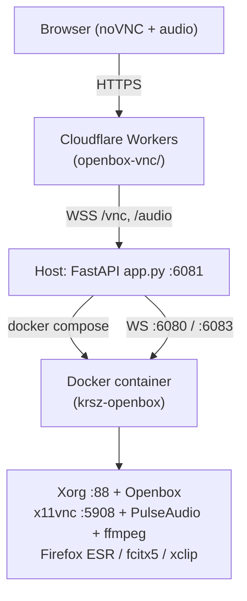

# openbox-vnc

A self-hosted, browser-accessible Linux desktop. A Debian + X11 + Openbox container exposes a VNC desktop with audio, a Cloudflare Workers frontend serves a noVNC dashboard, and a thin Python host process ties them together with WebSocket proxies and a clipboard bridge.

## Architecture



## Components

This repo is a two-tier monorepo.

| Path | Role | Tech |
|---|---|---|
| `./` (root) | Host controller + container image | Python 3 (FastAPI), Docker, Debian Bookworm, X11, Openbox, PulseAudio |
| [`openbox-vnc/`](openbox-vnc/) | Cloudflare Workers frontend | Next.js 16, React 19, OpenNext Cloudflare, D1 |

The frontend sub-project has its own [README](openbox-vnc/README.md) and [AGENTS.md](openbox-vnc/AGENTS.md); this file documents the whole system.

## Quick start

### Prerequisites

- Docker + Docker Compose v2
- Node.js 20+ and npm (for `openbox-vnc/`)
- ~6 GB free RAM (container is allocated 4 GB + 2 GB swap)
- Intel/AMD GPU on the host (the container uses `/dev/dri` for VA-API)

### 1. Build and run the container

```bash
docker compose up -d --build
```

This builds the Debian image in `Dockerfile` and starts `krsz-openbox` with GPU passthrough. Exposed ports:

| Port | Service |
|---|---|
| `5908` | x11vnc (raw VNC) |
| `6080` | noVNC WebSocket (websockify on X11 display :88) |
| `6082` | Container-side clipboard HTTP server |
| `6083` | Audio WebSocket stream (PulseAudio → ffmpeg → WS) |

### 2. Run the host controller

```bash
# app.py declares inline-script deps (PEP 723); uv will resolve them automatically
uv run app.py
# → FastAPI on 0.0.0.0:6081
```

The host controller proxies WebSocket traffic to the container and exposes control endpoints. See the [Host API](#host-api) table below.

### 3. Develop the frontend

```bash
cd openbox-vnc
npm install
npm run dev          # http://localhost:9999
```

## Host API (`app.py` on `:6081`)

| Method | Path | Purpose |
|---|---|---|
| `POST` | `/api/start` | `docker compose up -d --build` |
| `POST` | `/api/stop` | `docker compose down` |
| `POST` | `/api/restart` | `docker compose restart` |
| `GET` | `/api/status` | Container state (`online` / `offline`) |
| `POST` | `/api/clipboard` | Push clipboard text → container |
| `GET` | `/api/clipboard` | Read last clipboard value |
| `WS` | `/vnc` | VNC WebSocket proxy → container `:6080` |
| `WS` | `/audio` | Audio WebSocket proxy → container `:6083` |

Any other path returns a 302 redirect to `https://openbox.022025.xyz/`.

## Key files

| File | What it does |
|---|---|
| `Dockerfile` | Debian Bookworm + Xorg + Openbox + VNC + audio stack |
| `docker-compose.yml` | Container with Intel GPU passthrough, 4 GB RAM, exposed ports |
| `app.py` | Host FastAPI controller (compose control + WS proxies + clipboard) |
| `audio-server.py` | In-container: PulseAudio monitor → ffmpeg → WebSocket |
| `clipboard.py` | In-container: xclip ↔ host HTTP clipboard bridge |
| `entrypoint.sh` | Container startup: Xorg, Openbox, x11vnc, fcitx5, audio stream |
| `xorg.conf` | Modesetting driver with glamor for Intel GPU |
| `cmd.md` | Dev cheatsheet (Xvfb, Firefox profile, x0vncserver) |

## Security notes

- **`RESEND_API_TOKEN` lives in Cloudflare as a `secret`**, not in `wrangler.jsonc` `vars`. Set it with:
  ```bash
  cd openbox-vnc
  npx wrangler secret put RESEND_API_TOKEN
  ```
  Local development uses `openbox-vnc/.dev.vars` (gitignored).
- The container runs with `--privileged` and shares `/dev/dri`, `/dev/tty0`, `/dev/tty1`. Only run on a trusted host.
- x11vnc is started with `-nopw` (no password). The container is meant to live behind a controlled network boundary — do not expose `5908` directly to the public internet.

## License

Private project.
